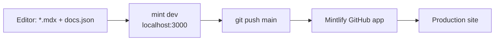

<div align="right">

[](https://mintlify.com/docs)
[](LICENSE)

</div>

# toxicwind Codex

### The estate's living documentation site — architecture, swarm operations, repo maps, and the archaeology of how it all got built. Powered by Mintlify.

This is the docs source for the **toxicwind Codex** site (`docs.json`). Every page is an `.mdx` file; push to `main` and the Mintlify GitHub app redeploys production automatically.

---

## What's inside

| Section | Covers |
|---|---|
| `setup/` | Hardware & runtime, isolation & sandboxing, zero-magic bootstrapping |
| `swarm/` | Lens picker, daemon hot-reload, env & unlocks, MCP registry |
| `repos/` | Per-repo maps: neo-osint, python-sdk-auditor, sovereign-scripts, awesome-api-shape-explorer, … |
| `api/` | Interface schema, under-the-hood internals |
| `pipelines/` | Failure vectors, vulnerability & quality, workflow-engine map |
| `archaeology/` | AST & technical debt, state & dependency lifecycle, the sunk-cost blueprint |



---

## Quick start

```bash
npm i -g mint
mint dev
```

Preview at `http://localhost:3000`. AI-assisted writing: `npx skills add https://mintlify.com/docs` installs Mintlify's docs skill for Claude Code, Cursor, and Windsurf.

---

## Structure

- `docs.json` — site config: name, nav, theme (edit this to add pages)
- `index.mdx` / `quickstart.mdx` — landing and onboarding pages
- `api/`, `archaeology/`, `pipelines/`, `repos/`, `setup/`, `swarm/` — content sections
- `logo/`, `favicon.svg` — branding

To add a page: drop an `.mdx` file in the right section and register it in `docs.json` navigation.

---

## Config

| Knob | Where |
|---|---|
| Site name, nav, theme | `docs.json` |
| GitHub app auto-deploy | Mintlify [dashboard](https://dashboard.mintlify.com/settings/organization/github-app) |
| Local preview port | `mint dev` → `http://localhost:3000` |

Troubleshooting: page 404s → make sure you're running `mint dev` in the folder containing `docs.json`; stale CLI → `mint update`.

---

## Contributing

Docs are code: open a PR with the `.mdx` change. Keep pages focused, link liberally between sections (no orphaned pages), and preview with `mint dev` before pushing. Component reference lives in the [Mintlify docs](https://mintlify.com/docs).

---

## License & security

**MIT** — see [LICENSE](LICENSE).

This repo holds documentation only — no secrets, no credentials. If a page ever needs a token or key for an example, use an obvious placeholder and never a real value.
